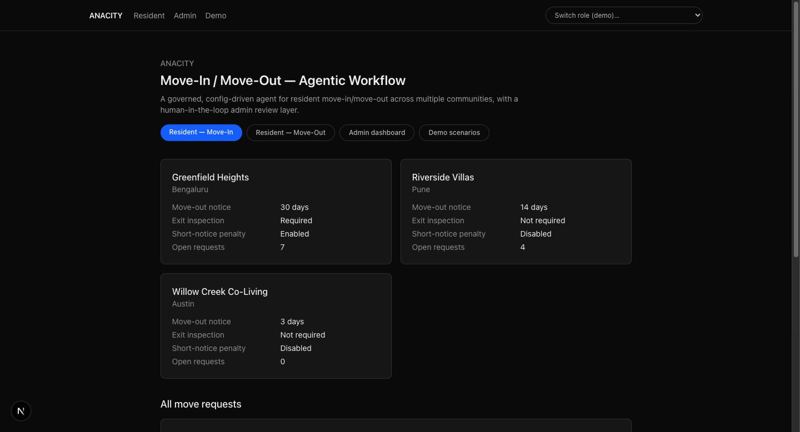
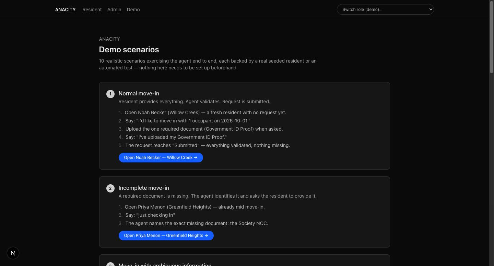
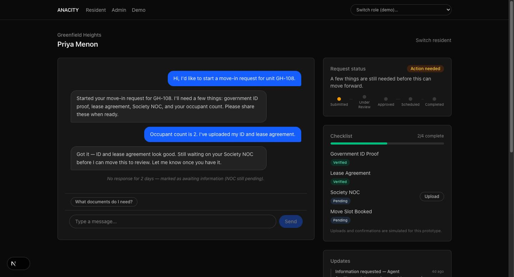
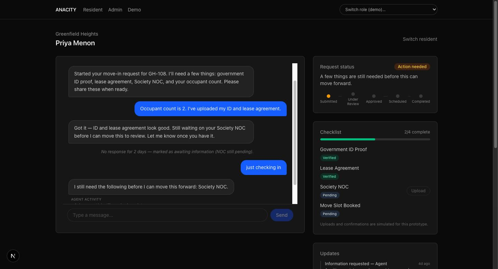
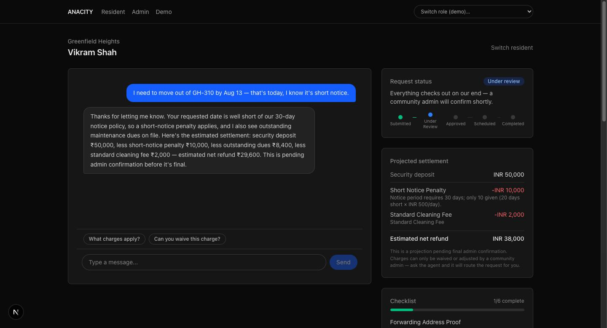
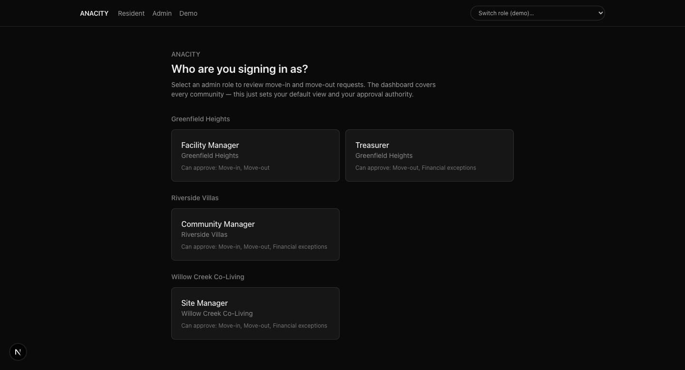
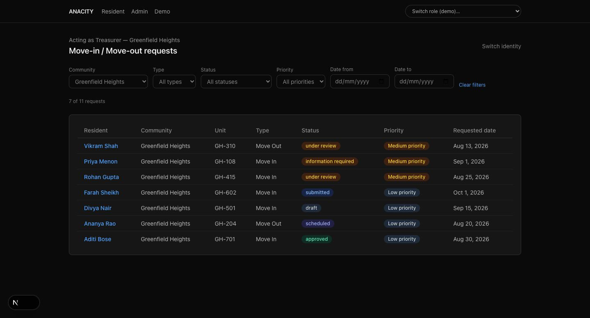
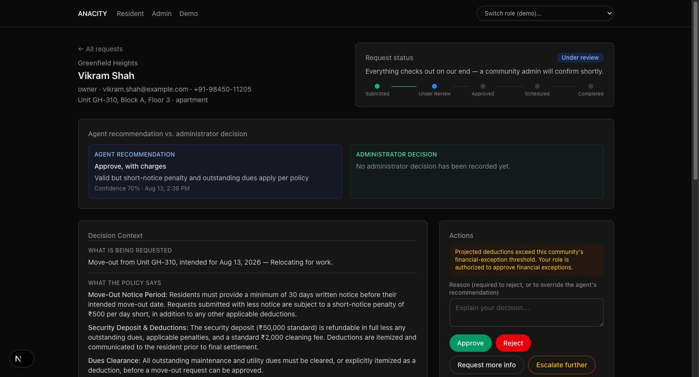

# ANACITY Move-In / Move-Out — Agentic Workflow

A governed, tool-mediated AI agent that handles resident move-in and move-out requests across multiple residential communities, with a human-in-the-loop administrator review layer. Built as an SDE-3 interview assessment for ANACITY (ANAROCK).

> **For a full engineering write-up** — architecture rationale, agent design, guardrails, autonomy model, trade-offs, assumptions, limitations — see **[EXPLANATION.md](./EXPLANATION.md)**. This README is the quick-start / evaluator-facing summary.

---

## 1. Project Overview

Move-in and move-out are handled today as manual, paperwork-heavy processes that vary by community. This project replaces that with a chat-first resident experience backed by a deterministic, config-driven agent: it validates requests against real per-community rules, explains what's missing, calculates move-out charges, and recommends outcomes — but it can never approve, reject, or waive anything itself. Every consequential decision goes to a human administrator. The same agent and tool code runs, unmodified, across three communities with meaningfully different rules, because all community-specific policy lives in configuration, not code.

**Runs entirely on mocked, in-memory data. No database, no external API keys, no hosting required.**

---

## 2. Key Capabilities

- **Chat-driven resident workspace** for both move-in and move-out, with live checklist and status tracking.
- **Deterministic policy grounding** — every policy statement the agent makes traces back to real, retrieved community policy data; it never invents an answer.
- **Deterministic charge calculation** for short-notice move-outs, computed from community configuration, never estimated.
- **Ambiguity handling** — conflicting resident-provided facts or multi-clause policy topics are surfaced for clarification, never silently resolved by guessing.
- **Structural guardrails** — 8 named guardrail categories that can only downgrade the agent's autonomy for a turn, never grant more of it.
- **Human-in-the-loop admin dashboard** — every request shows the agent's recommendation and the administrator's actual decision as two distinct, separately-recorded things.
- **Multi-community scalability** — three communities with different notice periods, currencies, charge rules, and admin-approval authority run on identical agent/tool code, driven entirely by configuration.
- **Full audit trail** — every tool call, recommendation, and admin decision is recorded.
- **270 automated tests** covering unit logic, tool contracts, orchestrator behavior, multi-community scenarios, and security/guardrail proofs.

---

## 3. Architecture Diagram

```
┌─────────────────────────────────────────────────────────┐
│  UI  (Next.js App Router — resident workspace, admin      │
│  dashboard, /demo cheat-sheet)                             │
└───────────────────────────┬───────────────────────────────┘
                             │  fetch (JSON over HTTP)
┌───────────────────────────▼───────────────────────────────┐
│  API / Application Layer  (Next.js Route Handlers)          │
│  Zod-validates every request before anything runs           │
└───────────────────────────┬───────────────────────────────-┘
                             │
┌───────────────────────────▼───────────────────────────────┐
│  Agent Orchestrator                                          │
│  classify intent → gather context → select tool → execute →  │
│  run guardrails → decide → update state → respond            │
└──────────────┬─────────────────────────┬───────────────────┘
               │                         │
┌──────────────▼─────────┐   ┌───────────▼──────────────────┐
│  Context Builder         │   │  LLMAgentProvider              │
│  assembles resident,     │   │  intent classification only —  │
│  request, policy, and    │   │  mocked today; this is the     │
│  history for this turn   │   │  seam a real LLM plugs into     │
└──────────────┬──────────┘   └────────────────────────────────┘
               │
┌──────────────▼──────────────────────────────────────────────┐
│  Tool Registry  (17 tools — role-gated, Zod-validated)         │
└──────────────┬──────────────────────────────────────────────-┘
               │
┌──────────────▼──────────────────────────────────────────────┐
│  Domain Services  (Community, Resident, MoveRequest, policy    │
│  validation & charge calculation)                               │
└──────────────┬──────────────────────────────────────────────-┘
               │
┌──────────────▼──────────────────────────────────────────────┐
│  Repository Layer  (interfaces only — swappable for a real DB) │
└──────────────┬──────────────────────────────────────────────-┘
               │
┌──────────────▼──────────────────────────────────────────────┐
│  Mock Data  (in-memory — 3 communities, 13 residents,          │
│  11 move requests)                                               │
└───────────────────────────────────────────────────────────-──┘
```

The agent never selects a tool, decides an outcome, or writes reply text — the orchestrator (deterministic code) does. The LLM's only job is turning a resident's message into a classified intent, which is why it's drawn beside the orchestrator, not above the tool layer. Full rationale in [EXPLANATION.md §4–§5](./EXPLANATION.md#4-architecture).

---

## 4. Tech Stack

| Layer | Choice |
|---|---|
| Framework | Next.js 16 (App Router, Turbopack) |
| UI | React 19, Tailwind CSS v4 |
| Language | TypeScript (strict mode) |
| Validation | Zod 4 (`.strict()` schemas at every tool boundary) |
| Unit / integration tests | Vitest 4 |
| End-to-end tests | Playwright |
| Lint / format | ESLint 9 (flat config), Prettier |
| Data layer | In-memory mock repositories behind real repository interfaces |
| LLM | None wired up — a deterministic `MockAgentProvider` stands in; see [EXPLANATION.md §12](./EXPLANATION.md#12-mocking-strategy) |

No database, no auth provider, no cloud services — everything needed to run this project is in this repository.

---

## 5. Agentic Workflow

Each resident message is one orchestrator turn:

1. **Classify intent** — the (mocked) LLM turns free text into one of a fixed set of intents (start move-in, provide info, ask a question, dispute a charge, etc.) plus a few narrowly-typed extracted fields.
2. **Gather context** — the orchestrator assembles the resident, their request, checklist, documents, and only the policy clauses actually retrieved this turn.
3. **Select and execute tools** — deterministic orchestrator code, not the LLM, decides which of the 17 registered tools to call.
4. **Run guardrails** — 8 checks (authorization, policy grounding, financial boundaries, ambiguity, sensitive data, valid state transitions, and more) that can only cap the agent's autonomy for this turn, never raise it.
5. **Decide the autonomy tier** — guide, recommend, decide, act, or escalate (see [EXPLANATION.md §6](./EXPLANATION.md#6-autonomy-model)). Anything touching money, an exception, or an approval is always escalated to a human — never taken autonomously.
6. **Respond and record** — every tool call, recommendation, and state change is written to an audit trail.

---

## 6. Resident Workflow

1. Pick a community and a resident identity (mocked — no real login) from `/resident` or `/resident/move-out`.
2. Start a move-in or move-out request in chat, or resume an existing one.
3. The agent validates the request live and names exactly what's missing (a specific document, a conflicting fact, an unmet notice period) — never a generic "incomplete."
4. Upload documents or answer questions directly in chat; each answer re-triggers validation.
5. For move-out, the agent explains the applicable notice-period policy up front and calculates any short-notice charges through a real tool — always framed as pending admin confirmation.
6. Ask policy questions at any point and get an answer grounded in that specific community's real policy — or an honest "no policy on file."
7. A status card and checklist progress bar show where the request stands at every step.

## 7. Admin Workflow

1. Pick an admin identity (role + community) from `/admin`, or use the role switcher in the header to jump between any seeded persona.
2. The dashboard lists every request across all communities, filterable by community, type, status, and priority.
3. Opening a request shows the **Decision Context** panel — what's requested, the applicable policy, what's missing, what was validated — alongside the agent's recommendation shown separately from the admin's own decision.
4. Available actions (approve / reject / request more info / escalate) are computed live from the state machine — only legal transitions are ever offered.
5. Financial decisions above a community's threshold are gated to admin roles with the authority to approve them.
6. Every decision — whether it agrees with or overrides the agent's recommendation — is recorded with the admin's identity and, when overriding or rejecting, a required reason.

---

## 8. Demo Scenarios

`/demo` is a guided cheat-sheet linking directly into 10 pre-seeded scenarios — the fastest way to evaluate the agent's behavior without typing anything from scratch:

| # | Scenario | What it proves |
|---|---|---|
| 1 | Normal move-in | Clean request, everything provided, agent validates and submits |
| 2 | Incomplete move-in | Agent names the exact missing document |
| 3 | Ambiguous move-in info | Conflicting occupant count — agent asks, never guesses |
| 4 | Normal move-out | Notice satisfied, request proceeds cleanly with a recommendation |
| 5 | Move-out with charges | Real, calculated charges — never an estimate |
| 6 | Move-out dispute | Resident disputes a charge — agent escalates, never rules on it |
| 7 | Community-specific policy | Identical question, two different config-driven answers |
| 8 | Admin review | Agent recommendation vs. admin decision, shown distinctly |
| 9 | Unauthorized action | A resident attempting an admin-only action is denied structurally |
| 10 | Agent / tool failure | A simulated tool failure degrades gracefully, never crashes |

Scenarios 9 and 10 are proven via automated tests rather than the live UI (by design — see the note on each in `/demo`): run `npm test -- scenarios`.

---

## 9. Project Structure

```
src/
├── agents/          Orchestrator, guardrails, state machine, LLM provider interface
├── app/              Next.js App Router — pages and API route handlers
│   ├── admin/        Admin dashboard
│   ├── api/           Route handlers (agent chat, resident workspace, admin actions)
│   ├── demo/          Guided demo-scenario cheat-sheet
│   └── resident/      Resident move-in / move-out workspaces
├── components/       Shared UI components
├── config/           Per-community configuration and policy data (the scalability layer)
├── domain/           Core entity types (Resident, MoveRequest, Community, etc.)
├── features/         Feature-specific UI (admin, move-in, move-out, resident, shared)
├── lib/               Cross-cutting utilities (env, service container, policy engine)
├── mocks/            In-memory mock data and repository implementations
├── repositories/     Repository interfaces (the real-database swap point)
├── services/         Domain services (Community, Resident, MoveRequest)
├── tools/             The 17 agent tools, registry, and implementations
├── types/             Shared TypeScript types
└── tests/
    ├── unit/          Unit, integration, scenario, and security tests (270 tests)
    └── e2e/           Playwright end-to-end tests
```

---

## 10. Setup

```bash
git clone <repository-url>
cd anacity-move-workflow
npm install
```

That's it — no database to provision, no accounts to create, no API keys required.

---

## 11. Environment Variables

**None are required.** The app runs fully functional out of the box on mocked data.

One variable is optional, and only relevant if you want to wire in a real LLM later (not required to run or evaluate this project):

| Variable | Required? | Purpose |
|---|---|---|
| `ANTHROPIC_API_KEY` | No | Only checked by `lib/env.ts#isLlmConfigured()`. Unused today — a deterministic mock stands in for the LLM. See [EXPLANATION.md §17](./EXPLANATION.md#17-production-architecture). |

There is no `.env.example` because there is nothing required to fill in.

---

## 12. Run Commands

```bash
npm run dev
```

Open **http://localhost:3000** (the terminal will print the actual port if 3000 is in use). Start at `/demo` for the guided scenario walkthrough, or `/` for the full entry hub (all 3 communities, resident/admin/demo links).

```bash
npm run build   # production build
npm run start   # run the production build
```

---

## 13. Test Commands

```bash
npm test          # Vitest — unit, integration, scenario, and security tests
npm run test:watch  # Vitest in watch mode
npm run test:e2e    # Playwright end-to-end smoke test
```

Current status: **270/270 tests passing across 21 files** (`npm test`).

`npm run test:e2e` requires a one-time `npx playwright install` for its browser binary before first use.

---

## 14. Build Commands

```bash
npm run typecheck   # tsc --noEmit — strict mode
npm run lint         # ESLint (flat config)
npm run build        # Next.js production build
```

All three are clean at the current commit.

```bash
npm run format        # Prettier — write mode
npm run format:check  # Prettier — check mode, no writes
```

---

## 15. Screenshots / Demo Guidance

Every screenshot below is a real, unedited capture of the running app on its default seed data (`npm run dev`, no setup). Reproduce any of them yourself with the exact steps listed underneath each one.

### Home page

**Steps:** `npm run dev` → open `http://localhost:3000`.



All three communities are real config, not copy — notice period, inspection requirement, short-notice penalty, and open-request count are read live from `CommunityConfiguration` and the mock repositories.

### Demo scenarios

**Steps:** Click **Demo scenarios** in the header, or open `/demo` directly.



A guided cheat-sheet into 10 pre-seeded scenarios — the fastest way to evaluate the agent without typing anything from scratch.

### Resident chat — mid move-in

**Steps:** From `/demo`, click **Open Priya Menon — Greenfield Heights** (or go directly to `/resident/community-greenfield-heights/resident-priya-menon`).



The status stepper, checklist (2/4 complete), and full conversation history are all real — reloading this page rebuilds every one of them from the server, nothing is cached only in the browser.

### Agent identifies missing information

**Steps:** In the same chat, type `just checking in` and send.



The agent re-derives what's missing from real checklist/document state on every turn — it doesn't remember "Priya is missing something," it re-validates and names the specific document each time.

### Move-out charge calculation

**Steps:** Open `/resident/move-out/community-greenfield-heights/resident-vikram-shah` and ask about move-out charges.



The **Projected settlement** panel is a real, itemized `calculateMoveOutCharges` result (₹50,000 deposit − ₹10,000 short-notice penalty − ₹2,000 cleaning fee = ₹38,000 net refund) — never an LLM-estimated figure, and always labeled as pending admin confirmation.

### Admin sign-in — role-based authority

**Steps:** Click **Admin dashboard** in the header, or open `/admin`.



Approval authority is per-role, per-community data, visible before you even sign in — a Facility Manager can approve move-ins/move-outs; only a Treasurer can approve a financial exception here.

### Admin dashboard

**Steps:** Pick **Treasurer — Greenfield Heights**.



Every request across the community, filterable by type, status, priority, and date — computed server-side, not a client-side guess.

### Agent recommendation vs. administrator decision

**Steps:** Click into **Vikram Shah**'s request from the dashboard above.



The agent's recommendation ("Approve, with charges," 70% confidence) and the administrator's decision are two distinct, separately-colored panels — never merged into one verdict. Note the amber notice: this request's deductions exceed the financial-exception threshold, and only a role with that specific authority (Treasurer, here) sees Approve enabled.

---

For a scripted, no-typing tour instead: open `/demo`, click into Scenario 1, then Scenario 8 to see the same request from the admin side — this pair alone shows the full resident → agent → admin loop in under a minute. For a fully narrated, timed walkthrough, see **[DEMO.md](./DEMO.md)**.

---

## 16. Further Reading

This README is intentionally a quick-start summary. For the full reasoning behind every architectural and product decision — problem interpretation, agent design, the autonomy model, guardrails, state machine, multi-community scalability, data model, mocking strategy, testing strategy, failure recovery, assumptions, trade-offs, production-readiness path, and honest limitations — see:

**[EXPLANATION.md](./EXPLANATION.md)**
